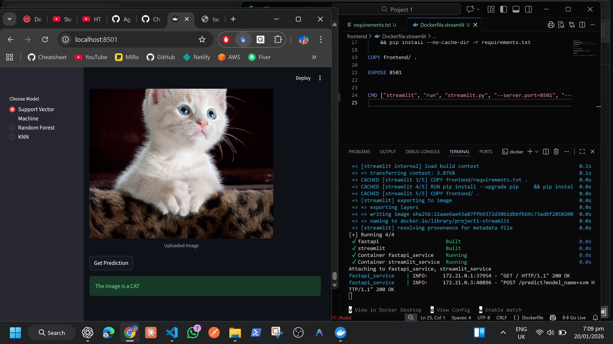
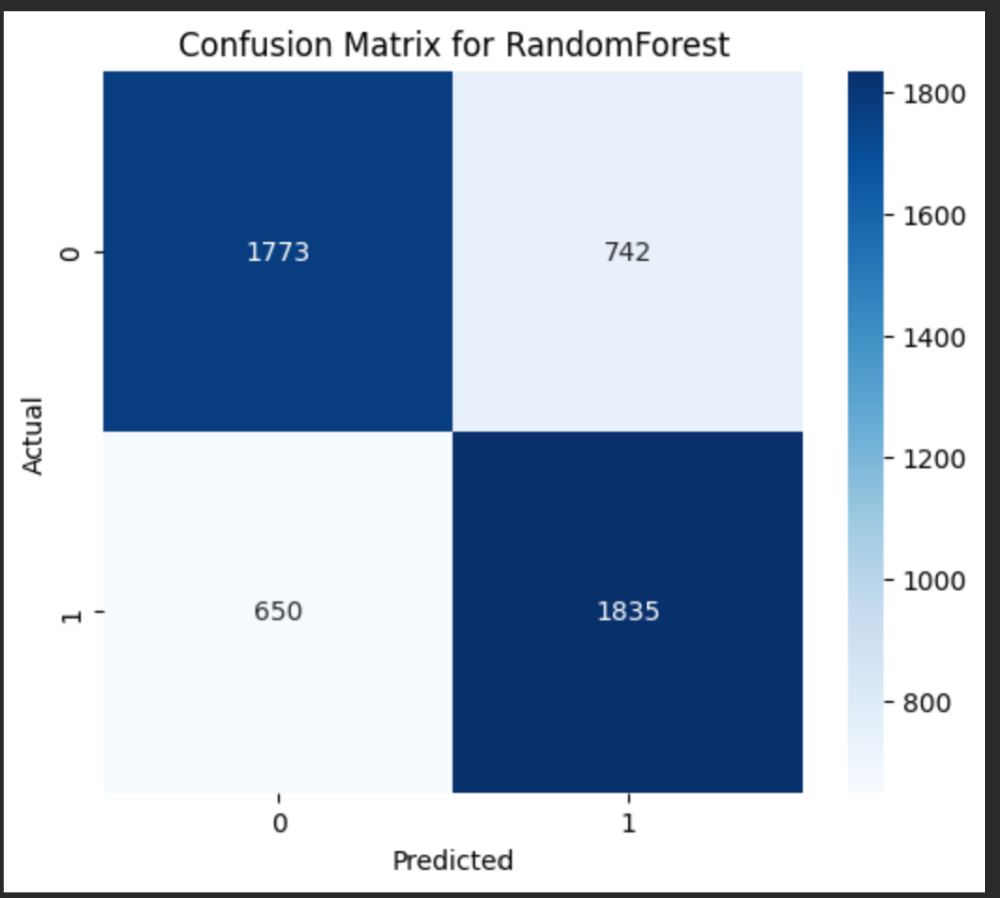
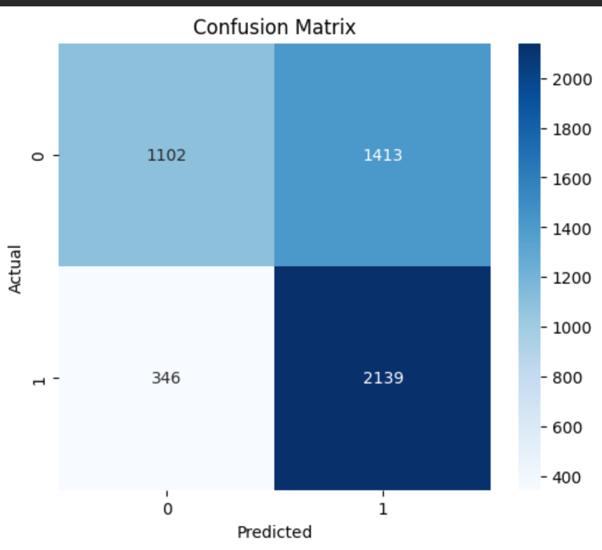

# Cat vs Dog Classification

This project classifies images of cats and dogs using traditional ML algorithms (SVM, Random Forest, KNN).

---
# APP UI


# Docker 



## Run App

```bash
docker compose up # to run the project

# for testing
http://localhost:8501  # to test streamlit
http://localhost:8000   # to test fast api

```

## Project Structure
```bash
Project 1/
 ├─ backend/
 │   ├─ app.py           # FastAPI app
 │   ├─ requirements.txt # FastAPI dependencies
 │   └─ ...other backend files
 ├─ frontend/
 │   ├─ streamlit.py     # Streamlit app
 │   ├─ requirements.txt # Streamlit dependencies
 │   
 ├─ models/
 │   ├─ svm_pipeline
 │   ├─ rf_pipeline
 │   └─ knn_pipeline
 └─ notebook/
     └─ Project_1_Image_class_ML.ipynb

```

## Dataset

Cat & Dog images used for training and evaluation.

---


## Results

**SVM**  
- Accuracy Score: 0.78 
- Precision Score: 0.77  
- Recall Score: 0.78 
- Cross val score: 0.77
- Confusion Matrix:  


**Random Forest**  
- Accuracy Score: 0.72
- Precision Score: 0.71
- Recall Score: 0.74
- Cross val score: 0.71
- Confusion Matrix:  


**KNN**  
- Accuracy Score: 0.65 
- Precision Score: 0.60
- Recall Score: 0.86
- Cross val score: 0.64  
- Confusion Matrix:  


---

## 📦 Tech Stack & Their Use

| Technology / Library | Purpose in Project |
|---------------------|------------------|
| **Streamlit** | Frontend web app for uploading images, choosing model, displaying predictions and logged history. |
| **FastAPI** | Backend API that receives uploaded images, preprocesses them, predicts using ML models, and logs results to the database. |
| **Docker** | Containerization to run both frontend and backend independently, with shared volumes for database and images. |
| **SQLite** | Lightweight database to store image filenames, predicted labels, and timestamps for logging purposes. |
| **scikit-learn** | Provides ML models (`SVM`, `Random Forest`, `KNN`) trained on Cat & Dog images. |
| **scikit-image (skimage)** | Used for HOG (Histogram of Oriented Gradients) feature extraction from images before prediction. |

---
