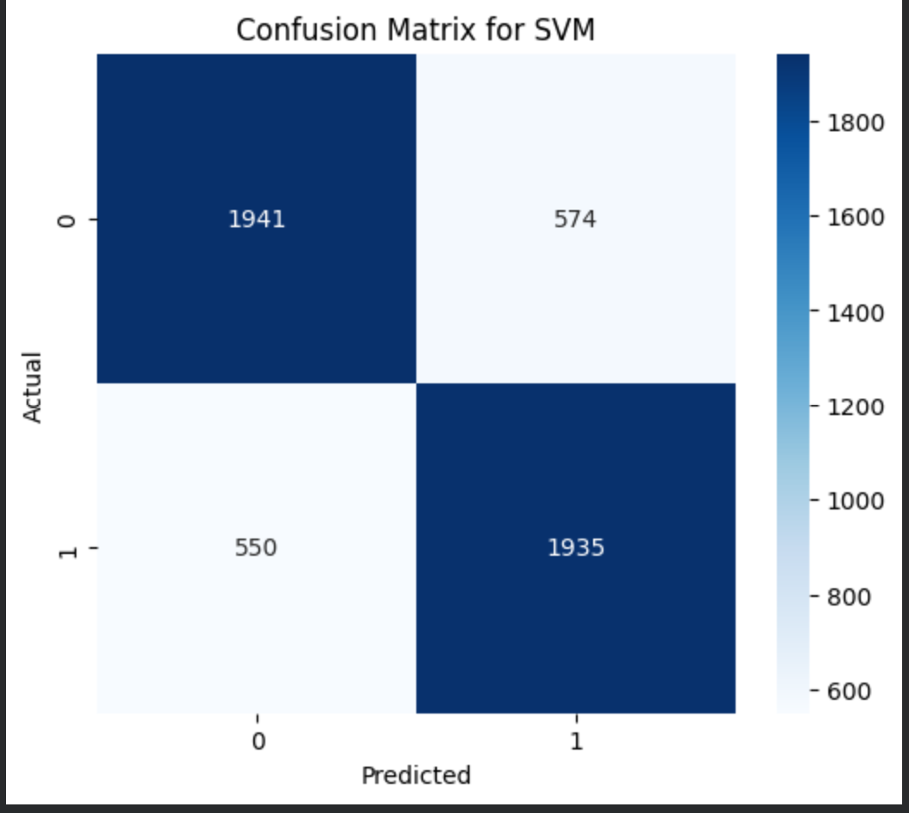
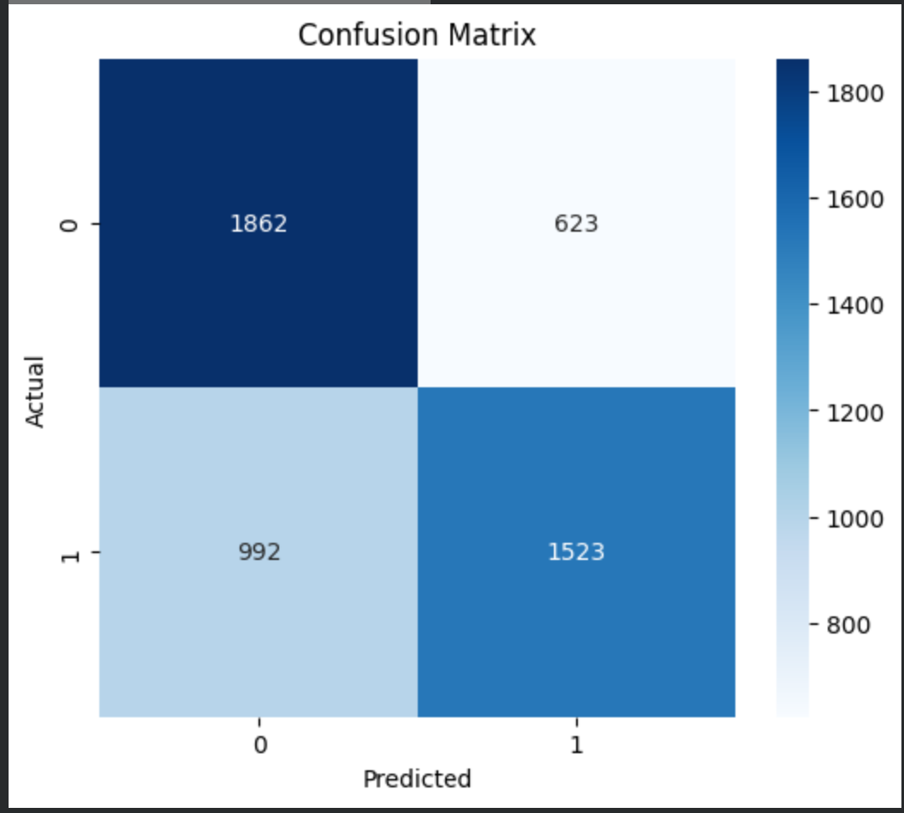
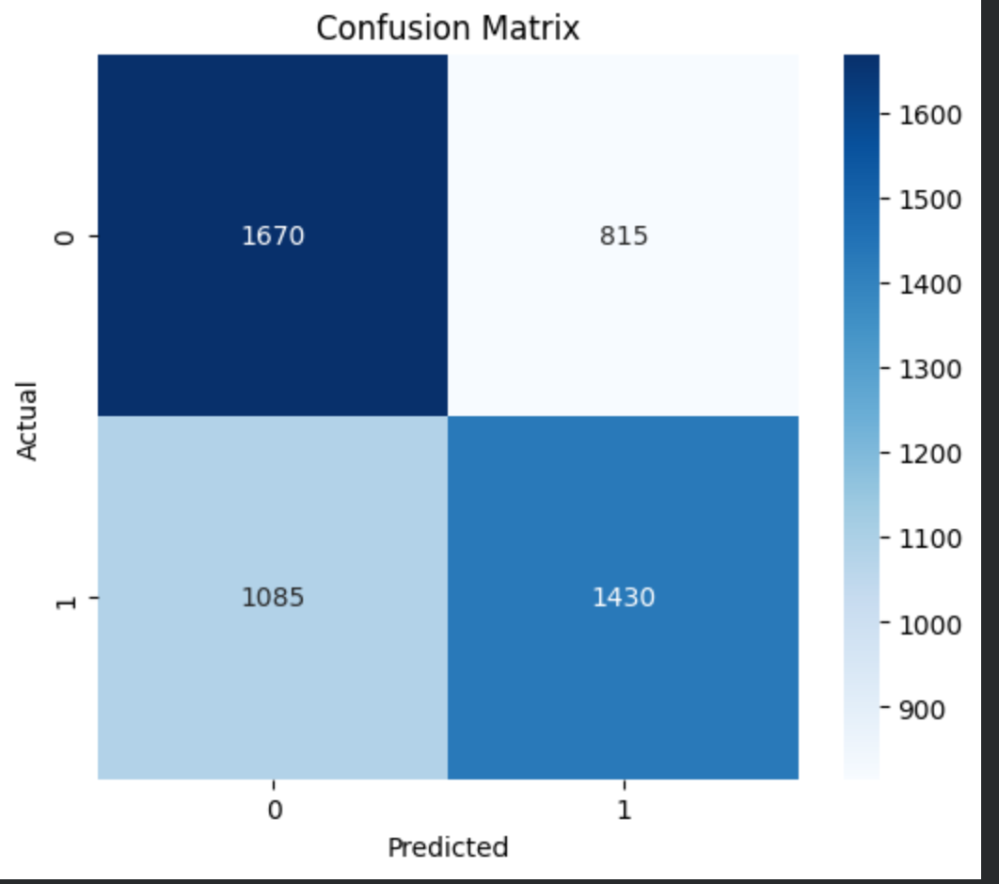

# Cat vs Dog Classification

This project classifies images of cats and dogs using traditional ML algorithms (SVM, Random Forest, KNN).

---
# APP UI


## Project Structure

.
├─ app.py               # Streamlit app
├─ requirements.txt     # Required packages
├─ src/
│   └─ utilities.py     # Helper functions
└─ notebook/notebook/Porject_1_Image_class_ML.ipynb


## Dataset

Cat & Dog images used for training and evaluation.

---

## Results

**SVM**  
- Accuracy Score: 0.683  
- Precision Score: {precision}  
- Recall Score: 0.617  
- Confusion Matrix:  



**Random Forest**  
- Accuracy Score: 0.677  
- Precision Score: {precision}  
- Recall Score: 0.606  
- Confusion Matrix:  


**KNN**  
- Accuracy Score: 0.62  
- Precision Score: {precision}  
- Recall Score: 0.569  
- Confusion Matrix:  


---

## Run App

```bash
streamlit run app.py

```

