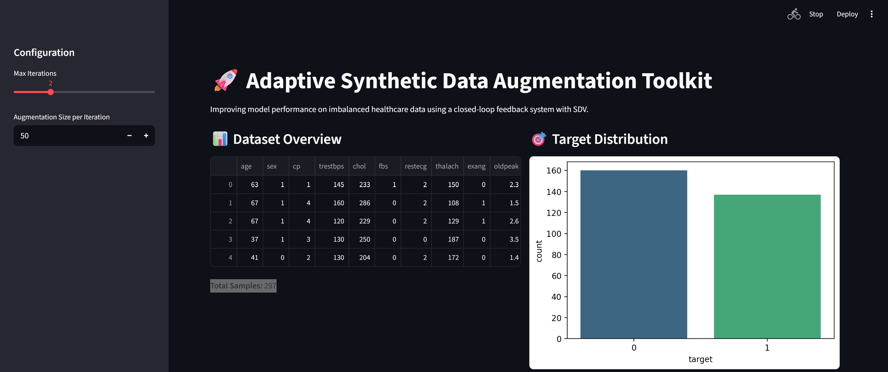
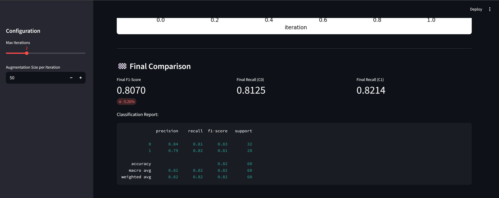

# Adaptive Synthetic Data Augmentation Toolkit



## Overview
The **Adaptive Synthetic Data Augmentation Toolkit** is a specialized framework designed to improve the performance of machine learning models on imbalanced datasets. By leveraging the **Synthetic Data Vault (SDV)** and a **closed-loop feedback system**, the toolkit identifies weak performance segments and generates targeted synthetic data to augment the training set iteratively.

## Key Features
- **Intelligent Segment Discovery**: Automatically identifies classes or data segments where the model performs poorly (low F1-score/Recall).
- **Targeted Synthetic Generation**: Uses `TVAESynthesizer` from SDV to generate high-fidelity synthetic samples for specific conditions.
- **Adaptive Augmentation Loop**: Iteratively retrains and evaluates the model, monitoring performance gains after each augmentation step.
- **Interactive Streamlit UI**: A professional dashboard to visualize data distributions, baseline performance, and the augmentation process.

## Installation
Ensure you have Python 3.9+ installed. Clone the repository and install the dependencies:

```bash
pip install streamlit pandas numpy matplotlib seaborn scikit-learn sdv
```

## Usage
To launch the interactive toolkit, run:

```bash
streamlit run app.py
```

## Methodology

### 1. Baseline Performance Analysis
The toolkit begins by training a **Random Forest Classifier** on the original Heart Disease dataset. It evaluates the model across all segments to establish a baseline.


### 2. Adaptive Augmentation Process
The system enters an adaptive loop where it:
1. Identifies the "weak class" (the target class with the lowest F1-score).
2. Generates targeted synthetic samples using SDV `Condition` objects.
3. Augments the training set and retrains the model.
4. Monitors performance shifts in real-time.



## Results
Through this adaptive process, the toolkit typically achieves:
- **Improved Recall**: Significant gains in minority class detection.
- **Enhanced F1-Score**: Better balance between precision and recall across all classes.
- **Robust Model Training**: More generalized performance on unseen data by bridging gaps in the original state space.
