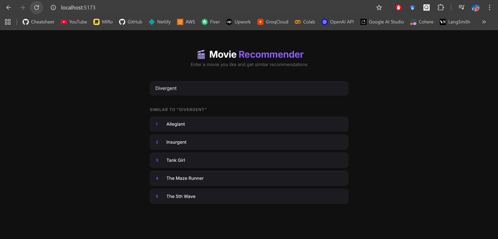

# Movie Recommender System

A content-based movie recommendation system built with **Python** and **React**. Enter a movie you like and get similar recommendations powered by TF-IDF and cosine similarity.


## Tech Stack

- **Backend** — FastAPI, scikit-learn, pandas, NLTK
- **Frontend** — React (Vite)
- **Dataset** — [TMDB 5000 Movies](https://www.kaggle.com/datasets/tmdb/tmdb-movie-metadata)

## How It Works

1. Movie metadata (genres, cast, crew, keywords, overview) is merged and preprocessed
2. Text is cleaned, tokenized, and lemmatized
3. TF-IDF vectors are computed for each movie
4. Cosine similarity finds the most similar movies to the user's input

## Setup

### Backend

```bash
uv init
uv add -r requirements.txt
uv run uvicorn main:app --reload
```

Backend runs at `http://localhost:8000`

### Frontend

```bash
cd frontend
npm install
cd ..
npm run dev
```

Frontend runs at `http://localhost:3000`

## API Endpoints

| Method | Endpoint | Description |
|--------|----------|-------------|
| GET | `/` | Health check |
| GET | `/movies` | List all movie titles |
| GET | `/recommend?movie=Avatar&top_k=5` | Get recommendations |

## Project Structure

```
├── backend/
│   ├── main.py            # FastAPI server
│   └── recommender.py     # ML model & recommendation logic
├── frontend/
│   └── src/
│       ├── App.jsx         # React UI
│       ├── App.css         # Dark mode styles
│       └── ...
├── data/
│   ├── tmdb_5000_movies.csv
│   └── tmdb_5000_credits.csv
├── notebook/
│   └── movie_recomender__system.ipynb
└── requirements.txt
```
